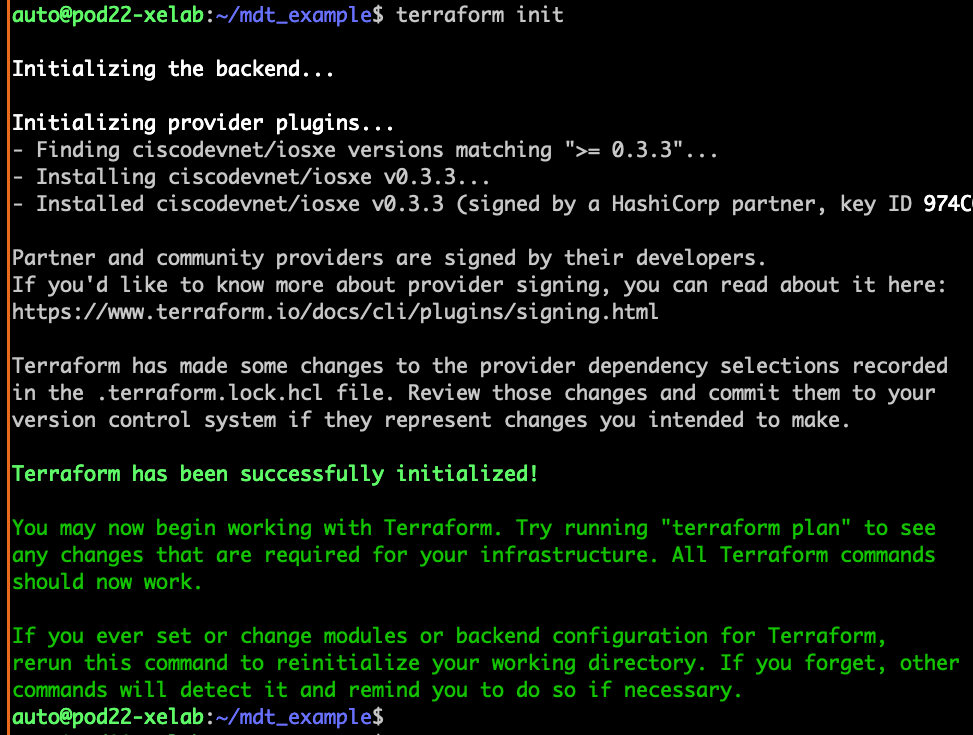
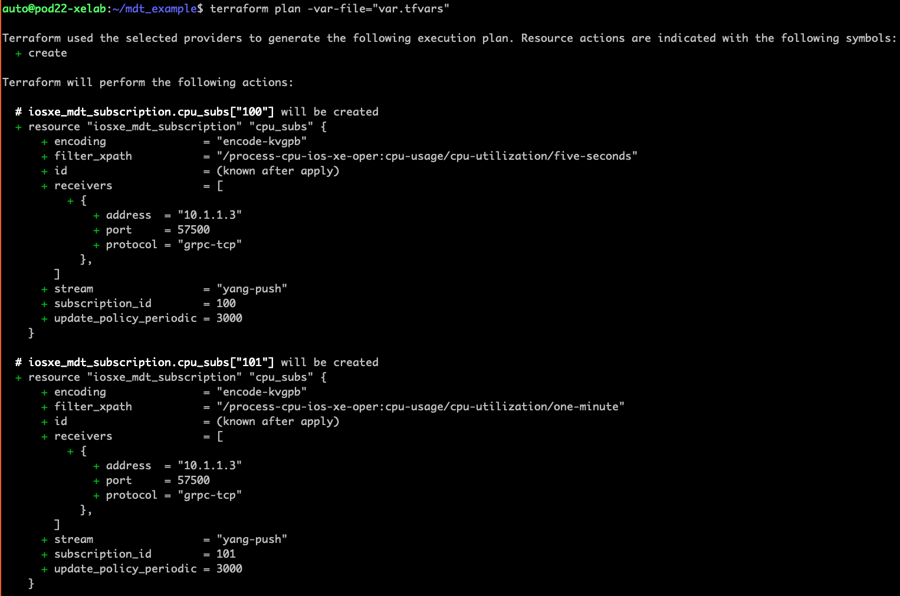
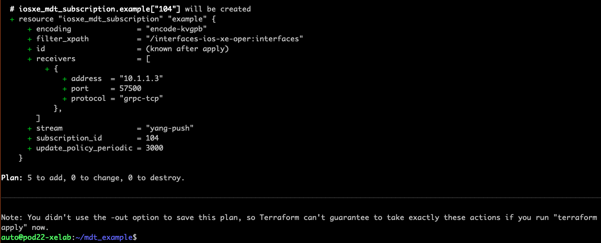
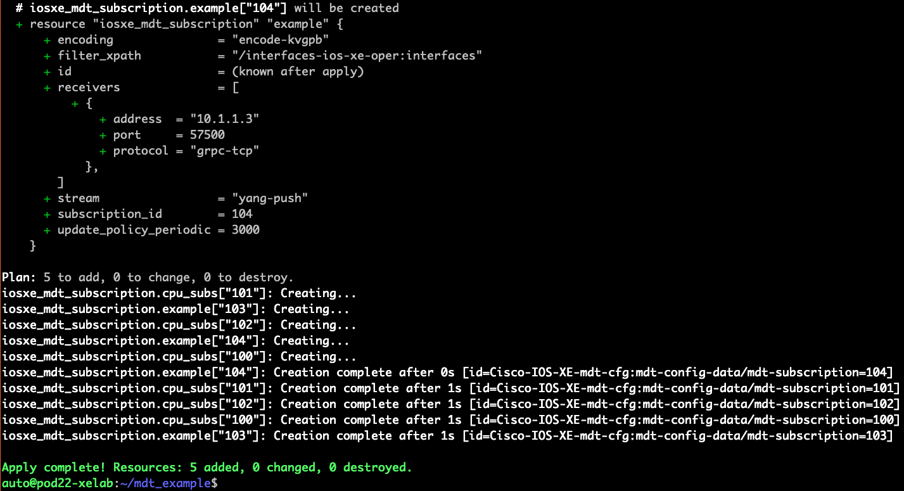
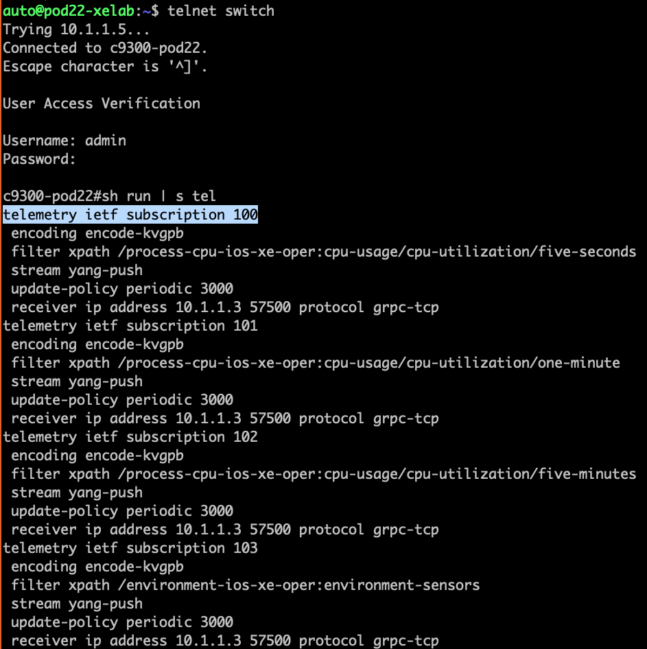
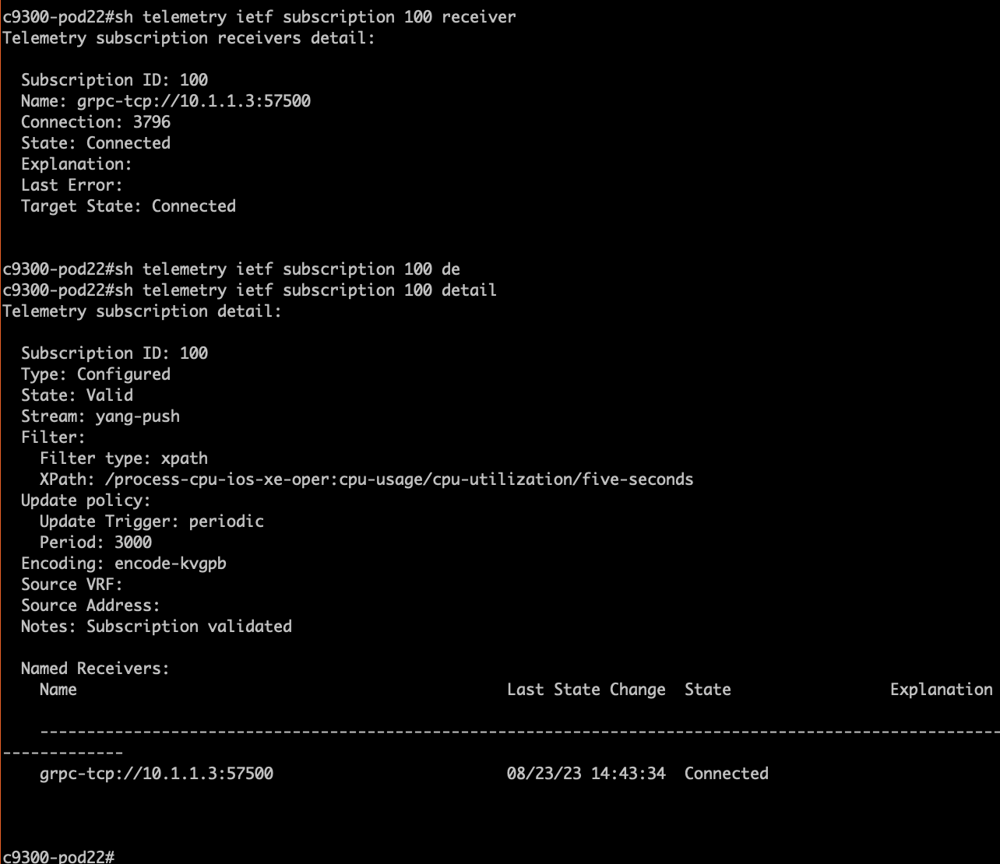
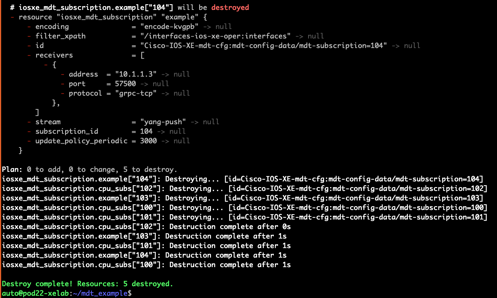

# Terraform Lab for MDT

# Introduction

In this lab you will review the confoguraiton for terraform including details of the switch to use and the Xpaths to enable for telemetry. The TF workflow will be demonstrated including the plan, apply, and destroy commands.

# Install TF
Ensure the terraform tool has already been installed into your envrionment first !


# Enable pre-req on IOS XE
For this usecase the folowing is required:

IOS XE 17.1 with RESTCONF enabled.

Refer to the following CLI quick-start example 

```
ip http secure-server
restconf
aaa new-model
aaa new-model
aaa authentication login default local
aaa authorization exec default local

```

Refer to Programmability Configuration Guide for details of RESTCONF that is used by the Terraform provider

# Review header.tf

The header describes details of the provider that is used which is the **CiscoDevNet/iosxe** version **0.3.3** provider.  Authentication and Access details for the Cisco IOS XE devices is also required in the header.

```
terraform {
  required_providers {
    iosxe = {
      source  = "CiscoDevNet/iosxe"
      version = ">= 0.3.3"
    }
  }
}

provider "iosxe" {
  username = "admin"
  password = "Cisco123"
  url      = "https://switch"
}
```

# Review var.tfvars

This file is where we set the variables for the telemetry subscriptions.

The example_periodic and cpu_periodic default update interval values are also set here.

```
source_address = "10.1.1.5"
receiver_ip = "10.1.1.3"
receiver_port = "57500"
example_periodic = "3000"
cpu_periodic = "3000"
```

# Review variables.tf

We could name the variables better here but we didn't yet so sorry. This file shows the variable definitions and the default vaules.

This file also has the list of variables that are looped through as part of the additional .tf configuration files for CPU and additonally defined Xpaths.


```
variable source_address {
    type = string
    default = "1.1.1.1"
    description = "Source address"
terraform {
}
variable receiver_ip {
    type = string
    default = "1.1.1.1"
    description = "Receiver IP"
}
variable receiver_port  {
    type = string
    default = "57500"
    description = "Port to send data to"
}
variable example_periodic {
    type = string
    default = "6000"
    description = "Long update interval"
}
variable cpu_periodic {
    type = string
    default = "100"
    description = "Short update interval"
}

#CPU.tf
variable "cpu_subscriptions" {
  default = {
    100 = {
      xpath = "/process-cpu-ios-xe-oper:cpu-usage/cpu-utilization/five-seconds"
    },
    101 = {
      xpath = "/process-cpu-ios-xe-oper:cpu-usage/cpu-utilization/one-minute"
    },
    102 = {
      xpath = "/process-cpu-ios-xe-oper:cpu-usage/cpu-utilization/five-minutes"
    }
  }
}

#XPATH.tf
variable "subscriptions" {
  default = {
    103 = {
      xpath = "/environment-ios-xe-oper:environment-sensors"
    },
    104 = {
      xpath = "/interfaces-ios-xe-oper:interfaces"

    }
  }

```

# Review cpu.tf

The CPU.tf has the loop which is used to loop through the Subscription ID Numbers and Xpaths from the previous configuraiton file. It also has some values defined for the encoding, stream, and update interval defaults.


```
resource "iosxe_mdt_subscription" "cpu_subs" {
  for_each               = var.cpu_subscriptions
  subscription_id        = each.key
  stream                 = "yang-push"
  encoding               = "encode-kvgpb"
  update_policy_periodic = var.cpu_periodic
#  source_address         = var.source_address
  filter_xpath           = each.value.xpath
  receivers = [
    {
      address  = var.receiver_ip
      port     = var.receiver_port
      protocol = "grpc-tcp"
    }
  ]
}
```
# Review xpaths.tf

Here are some additionally defined Xpaths for things like the envrionment-sensor and the Interfaces Operational data.

```
resource "iosxe_mdt_subscription" "example" {
  for_each               = var.subscriptions
  subscription_id        = each.key
  stream                 = "yang-push"
  encoding               = "encode-kvgpb"
  update_policy_periodic = var.example_periodic
#  source_address         = var.source_address
  filter_xpath           = each.value.xpath
  receivers = [
    {
      address  = var.receiver_ip
      port     = var.receiver_port
      protocol = "grpc-tcp"
    }
  ]
 }
```
 
### Great job at reviewing the config file we really hope it works

### Continue to next steps to run the TF tool and enable the configuration 


# Terraform workflow

##terraform init

The ```terraform init``` command is used to download the provider prior to planning or applying the configuraiton changes.



##terraform plan

Run the **terraform plan -var-file="var.tfvars"** command to show what TF is planning to do



Additional subscriptions are shown here ...

Then the total number of changes to add/change/destroy is seen. In this example 5 MDT subscipriotns will be added




##terraform apply

Run the apply command like **terraform apply -var-file="var.tfvars" -auto-approve** to apply the configuration to the device

Notice that 5 resources have been added successfully



## terraform destroy

The destory will be discussed in more detail after validation - however this is an optional and final part of the worflow when the configuration is not longer needed

# Validating the apply

## Review terraform.tfstate

This is one manual way to review that the TF state is and what was applied to the device

Review with **$ cat terraform.tfstate**

```
{
  "version": 4,
  "terraform_version": "1.3.4",
  "serial": 6,
  "lineage": "5b1d4493-490a-4d60-d07d-861eed9aa122",
  "outputs": {},
  "resources": [
    {
      "mode": "managed",
      "type": "iosxe_mdt_subscription",
      "name": "cpu_subs",
      "provider": "provider[\"registry.terraform.io/ciscodevnet/iosxe\"]",
      "instances": [
        {
          "index_key": "100",
          "schema_version": 0,
          "attributes": {
            "device": null,
            "encoding": "encode-kvgpb",
            "filter_xpath": "/process-cpu-ios-xe-oper:cpu-usage/cpu-utilization/five-seconds",
            "id": "Cisco-IOS-XE-mdt-cfg:mdt-config-data/mdt-subscription=100",
            "receivers": [
              {
                "address": "10.1.1.3",
                "port": 57500,
                "protocol": "grpc-tcp"
              }
            ],
            "source_address": null,
            "source_vrf": null,
            "stream": "yang-push",
            "subscription_id": 100,
            "update_policy_on_change": null,
            "update_policy_periodic": 3000
          },
          "sensitive_attributes": []
        },
```


## Run the GET !

How to do a GET to see what is configured ?

## CLI Validation

Login to the switch and check the running-config telemetry  section to ensure the 5 subscriptions were added successfully

Use the **show run | section telemetry** CLI to review the telemetry configuration that was applied



Check the receiver and detailed status of the newly added telemetry subscriptions with the following CLI's

**sh telemetry ietf subscription 100 receiver**

**sh telemetry ietf subscription 100 detail**

The above output shows the newly added telemetry subscriptions have been added successfully and are connected to the telemetry server and that the telemetry data is flowing.



# Terraform Destroy

Now that the MDT subscriptions has been added and verified the final step in the workflow is to destroy the resources to remove the MDT configuration.

Run the destroy command:

**terraform destroy -var-file="var.tfvars" -auto-approve**



The destroy command shows details of the telemetry subscriptions and TF resources that are being removed. It also shows that the 5 resources were destroyed with success.

# Conclusion

In this module we have reviewed the TF configuration to enable and manage the MDT feature on IOS XE


